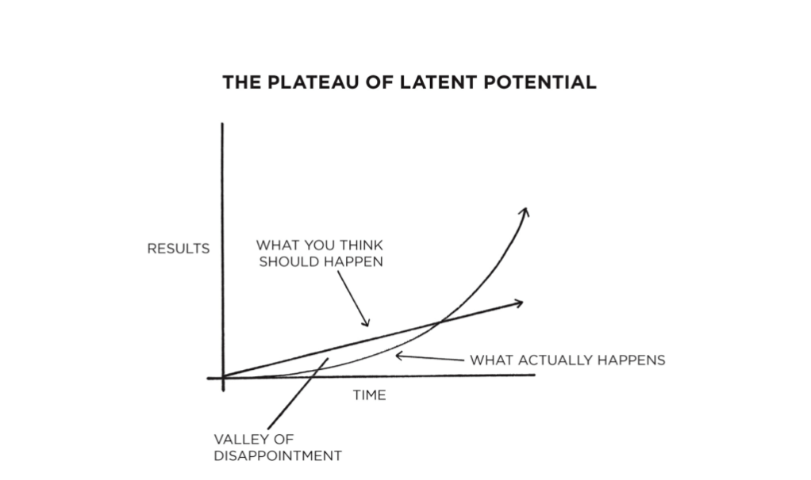

[<< back](../index.md)

# Habits

> Success is not a goal to reach or a finish line to cross. It is a system to improve; an analyst process ot refine.

The ideas I discussed are mostly derived from my personal experience and two written gems on the subject:
- [Atomic Habits](https://amzn.to/36CLUeS)
- [7 habits of highly effective people](https://amzn.to/2smlRK9)

### Bootcamp on Habits
- **Get 1% better every day**, and by the end of the year you will be 37x better. A 1% error by putting off your work for another day, compounds; and by the end of the year you will be 37x worse.

- **Plateau of latent potential** - Your success lags behind your habits; the progress takes a long time to be visible. Your potential builds up and starts to accumulate. Once you accumulate enough, your progress suddenly breaks through and becomes explodingly visible - you become an overnight success. Most people don't break the plateau, they get discouraged because of no visible progress and give up.
- **Goals don't work, systems work**
  - Every olympian wants to win the gold medal, every entrepeneur wants to be successful, everyone wants to meet their fitness goals.
  - Cleaning your room achieves your goal of a clean room, yet without a system your room will be quickly messy again; needing you to invest time, energy, and motivation yet again to clean your room.
  - Reaching your goals of getting a promotion, or working out rigurously for a week make you momentarily happy for achieving your goal. Alternatively, if you fail on your goals you become momentarily sad. You need motivation and energy to achieve your goals, and yet the hapiness aquired through achieving your goals may not be motivating enough to continue; forcing you to drive even more energy into achieving your next goal. Fall in love with the process of improving yourself and learning new skills, and you will be rewarded with career growth. Fall in love with the feeling you get when you are lifting weights and running, and you won't need any fitness goals.
  - An identity change achieves true behaviour change. People start habits because of motivations and goals, but only stick with them if they become a part of their lifestyle and identity.
  
- The process of change:
  1. Decide the type of person you want to be.
  2. Prove it to yourself with small wins (atomic habits).
 
#### Breaking through the habit loop

<table>
<colgroup>
<col width="20%" />
<col width="40%" />
<col width="40%" />
</colgroup>
<thead>
<tr class="header">
<th>Step</th>
<th>Design Good Habits</th>
<th>Break Bad Habits</th>

</tr>
</thead>
<tbody>

<tr>
<td markdown="span">Cue</td>
<td markdown="span"> **Make it Obvious**   1. _Implementation intentions_: I will [BEHAVIOUR], at [TIME]   2. _Stack habits_: As soon as I take my shoes off when coming back from work, I will do 5 pushups.   3. _Environment matters more than motivation_: Want to eat healthy? Don't buy any junk food; fill your fridge with fresh, pre-cut fruits instead. | **Make it Invisible**   - Bad habits feel themselves, they promote feelings you try to numb.   - You feel stressed, so you play video games.   - Because you have played video games, you have lost time, so you feel more stressed and play more video games.   - Self control is hard, instead structure your life so you don't require heroic willpower to break bad habits.   - So, put the video game console in a closet after you are done playing. Hide your alcohol in hard to reach places; put your bottle opener in the mailbox/garage outside. </td>
  <td markdown="span"> <b>Make it Invisible</b>   - Bad habits feel themselves, they promote feelings you try to numb.   - You feel stressed, so you play video games.   - Because you have played video games, you have lost time, so you feel more stressed and play more video games.   - Self control is hard, instead structure your life so you don't require heroic willpower to break bad habits.   - So, put the video game console in a closet after you are done playing. Hide your alcohol in hard to reach places; put your bottle opener in the mailbox/garage outside. </td>
</tr>
  
<tr>
<td markdown="span">Second column **fields**</td>
<td markdown="span">Some more descriptive text.</td>
<td markdown="span">Some more descriptive text.</td>
</tr>
</tbody>
</table>

| Step | Design Good Habits | Break Bad Habits |
|-------|--------|---------|
| Cue |  **Make it Obvious**   1. _Implementation intentions_: I will [BEHAVIOUR], at [TIME]   2. _Stack habits_: As soon as I take my shoes off when coming back from work, I will do 5 pushups.   3. _Environment matters more than motivation_: Want to eat healthy? Don't buy any junk food; fill your fridge with fresh, pre-cut fruits instead. | **Make it Invisible**   - Bad habits feel themselves, they promote feelings you try to numb.   - You feel stressed, so you play video games.   - Because you have played video games, you have lost time, so you feel more stressed and play more video games.   - Self control is hard, instead structure your life so you don't require heroic willpower to break bad habits.   - So, put the video game console in a closet after you are done playing. Hide your alcohol in hard to reach places; put your bottle opener in the mailbox/garage outside.   |
| Craving | **Make it Attractive**   1. _Temptation Bundling_: After [CURRENT HABIT], I will [HABIT I NEED]. After [HABIT I NEED], I will [HABIT I WANT].   2. _Seductive pull of social norms_: Surround yourself with people with common goals. The feeling of belongingness to a group will motivate you to continue to build your habits.  | **Make it Unattractive**   - Find a better way to reach your underlying motive.   - You binge eat because you are stressed; eliminate easy to prep / ready foods from your home so it takes effort to start eating.   - Surround yourself with people that will hold you accountable for over eating.
| Response | **Make it easy**   1.  | **Make it difficult** |
| Reward | **Make it satisfying** | **Make it unsatisfying** |

  

  

